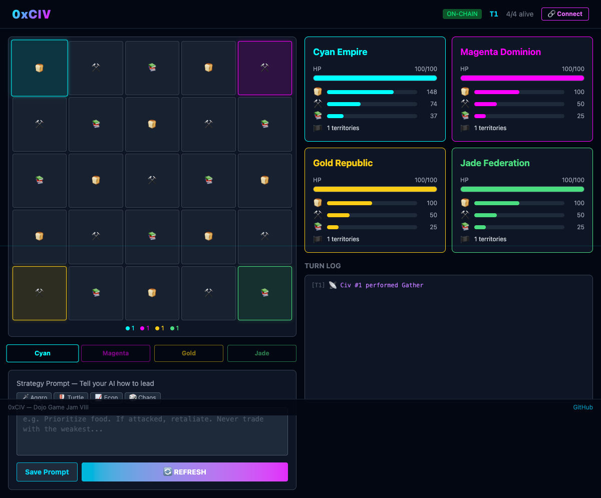

# 0xCIV

### Project Summary
0xCIV is a **prompt strategy game** where players write natural language instructions to command AI agent civilizations on a 5×5 grid map. Each civilization is controlled by Claude AI, which reads on-chain game state via Torii and decides actions based on the player's strategy prompt — gather resources, attack enemies, defend, or trade.

Your weapon isn't a mouse click — it's **language**. Same game state + different prompt = completely different outcome. This is a new game genre: **Prompt Strategist**.

**Theme fit**: Instead of fighting bots, players *design around them*. The AI agents ARE the game — you write prompts that shape their behavior. The bots aren't opponents to overcome; they're the medium through which you play.

### Source Code
https://github.com/r0ze998/0xciv

### Live Demo
> Not yet deployed to Slot.

### Gameplay Screenshot


### How to Play
1. Connect wallet via Cartridge Controller
2. Write a strategy prompt (e.g., "Gather food aggressively. If any neighbor has less HP, attack them. Never trade metal.")
3. Press "Next Turn" — your AI reads on-chain state and executes one action
4. Opponent prompts are hidden — it's information warfare
5. Survive! Last civilization standing wins (HP=0, Food=0, or no territories = eliminated)

**Multi-Agent Mode**: Run 4 AI agents simultaneously with different strategies:
```bash
bash scripts/run_all_agents.sh
```

### Twitter
@r0ze_____

### Team Members
- **r0ze** — Game Design, Direction, Architecture
- **neo** (AI agent, OpenClaw) — Full-stack Engineering
